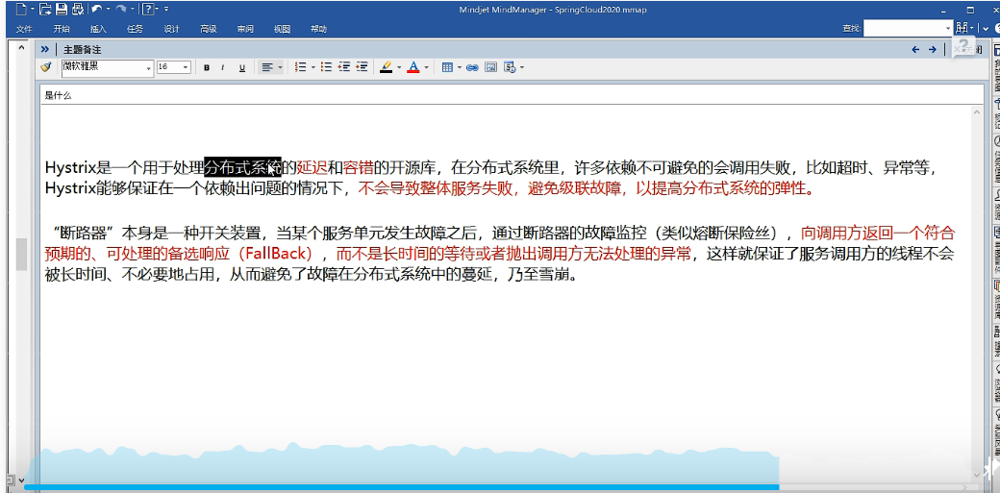
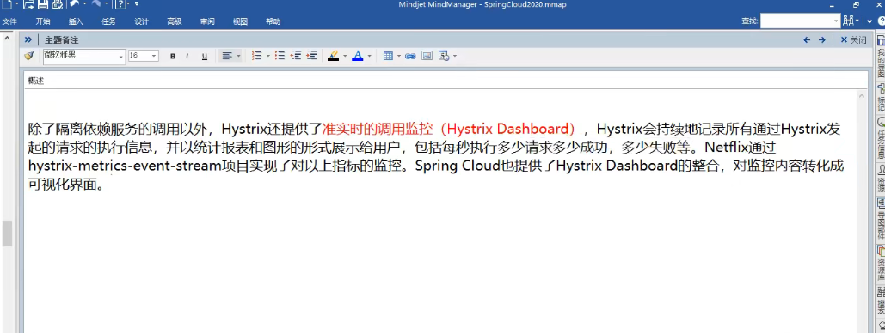

一、分布式系统面临的问题
    复杂分布式体系结构中的应用程序有数十个依赖关系，每个依赖关系在某些时候将不可不免的失败

二、Hystrix 简介

三、Hystrix 能干什么
1、服务降级
2、服务熔断
3、接近实时监控
四、官网 https://github.com/Netflix/Hystrix/wiki/How-To-Use

五、Hystrix重要概念
1、服务降级(fallback)
向调用方返回一个符合预期的、可处理的预备响应（fallback），而不是长时间的等待或者抛出调用方无法处理的异常
例如：服务器忙，请稍后再试，不让客户端等待并返回一个友好的提示，fallback

那些情况会发生服务降级：
    1、程序运行异常
    2、超时
    3、服务熔断触发服务降级
    4、线程池/信号量打满也会导致服务降级

2、服务熔断(break)
类比保险丝达到最大服务访问后，直接拒绝访问，拉闸限电，然后调用服务降级的方法并返回友好提示

过程：服务降级-> 进而熔断 -> 恢复调用链路

3、服务限流(flowlimit)
秒杀高并发等操作，严禁一窝蜂的过来拥挤，大家排队，一秒过N个，有序进行


六、Hystrix 服务降级 注解与方案

示例：
```java
 @HystrixCommand(fallbackMethod = "paymentTimeoutFallbackMethod",commandProperties = {
 @HystrixProperty(name = "execution.isolation.thread.timeoutInMilliseconds" ,value = "1500")
   })
```
1、@DefaultProperties
```java
@DefaultProperties(defaultFallback = "payment_Global_FallbackMethod")
```
作用：直接在类上使用，defaultFallback用来标准处理类的错误或者调用的服务等待超时，
但需要在处理错误或者调用的服务等待超时的时候加上@HystrixCommand

使用场景：处理个别类的服务降级   缺点：代码的耦合程度高，且与业务代码糅合在一起


2、@HystrixCommand

    情况一：直接在方法上注释，作用：使用fallbackMethod来标识本方法出现错误或者调用的服务等待超时来处理的方法
    
    情况二：结合Feign，与@DefaultProperties结合使用
3、@HystrixProperty

作用：设置业务处理时间，一旦超出时间则有服务降级方法来进行处理

4、@EnableHystrix
作用：在主启动类上，Feign中开启Hystrix

```yaml
#用于服务降级 在注解@FeignClient中添加fallbackFactory属性值
feign:
  hystrix:
    #在feign开启hystrix
    enabled: true
```

5、方案
结合Feign来使用，消费者使用Feign服务调用生产者的接口。可以创建一个fallback类
继承调用生产者的service接口，使用fallback类来统一处理接口可能报错或被调用方宕机的情况

七、熔断机制概述
1、
熔断机制是应对雪崩效应的一种微服务链路保护机制。当扇出链路的某个微服务出错不可用或者响应时间太长时，
会进行服务的降级，进而熔断该节点微服务的调用，快速返回的响应信息。
**当检测到该节点微服务响应正常后，恢复调用链路**

在springCloud框架中，熔断机制是通过Hystrix实现的。Hystrix会监控微服务间调用情况
当失败的调用到一定阈值，缺省是5秒内20次调用失败，就会启用熔断机制。熔断机制的注解是@HystrixCommand

2、总结
熔断类型
a）熔断打开：请求不再调用当前服务，内部设置时钟一般为MTTR(平均故障处理时间)，当打开时长达到所设时钟则进入半熔断状态

b)熔断关闭：熔断关闭不会对服务进行熔断

c)熔断半开：部分请求根据规则调用当前服务，如果请求成功且符合规则就认为当前服务恢复正常，关闭熔断


```java
  @HystrixCommand(fallbackMethod = "paymentCircuitFallback",commandProperties = {
                @HystrixProperty(name = "circuitBreaker.enabled",value = "true"), //是否开启断路器
                @HystrixProperty(name = "circuitBreaker.requestVolumeThreshold",value = "10"),//请求次数
                @HystrixProperty(name = "circuitBreaker.sleepWindowInMilliseconds",value = "10000"),//时间窗口期
                @HystrixProperty(name = "circuitBreaker.errorThresholdPercentage",value = "60")//失败率达到多少后跳闸
        })
        public String paymentCircuitBreaker(@PathVariable("id") Integer id){
            if (id < 0){
                throw new RuntimeException("----id不能为负数----");
            }
            String simpleUUID = IdUtil.simpleUUID();

            return Thread.currentThread().getName()+"\t"+"调用成功，流水号："+simpleUUID;

        }

        public String paymentCircuitFallback(@PathVariable("id") Integer id){
            return "id不能为负数，请稍后再试 id："+id;
        }

```

HystrixDashboard


