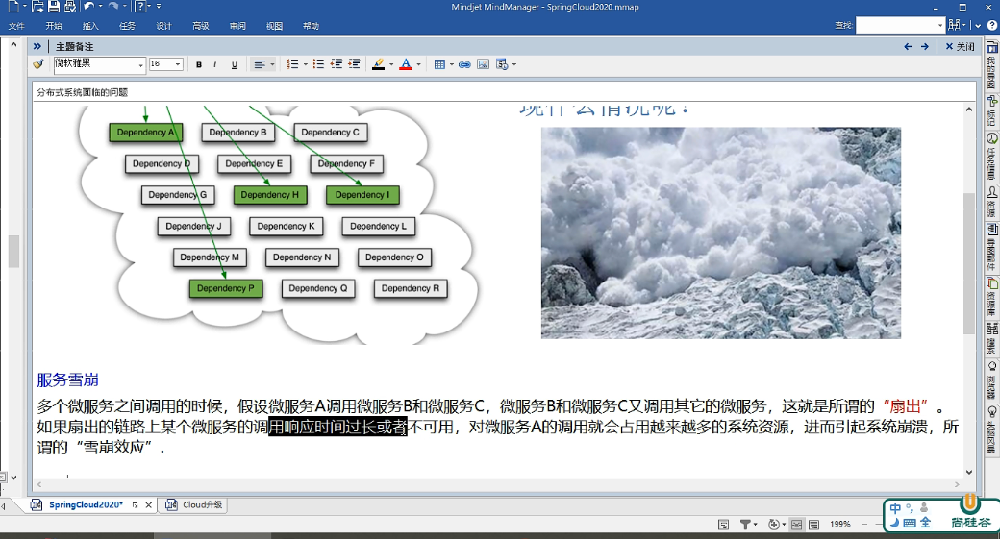

一、分布式系统面临的问题
    复杂分布式体系结构中的应用程序有数十个依赖关系，每个依赖关系在某些时候将不可不免的失败

二、Hystrix 简介

三、Hystrix 能干什么
1、服务降级
2、服务熔断
3、接近实时监控
四、官网 https://github.com/Netflix/Hystrix/wiki/How-To-Use

五、Hystrix重要概念
1、服务降级(fallback)
向调用方返回一个符合预期的、可处理的预备响应（fallback），而不是长时间的等待或者抛出调用方无法处理的异常
例如：服务器忙，请稍后再试，不让客户端等待并返回一个友好的提示，fallback

那些情况会发生服务降级：
    1、程序运行异常
    2、超时
    3、服务熔断触发服务降级
    4、线程池/信号量打满也会导致服务降级

2、服务熔断(break)
类比保险丝达到最大服务访问后，直接拒绝访问，拉闸限电，然后调用服务降级的方法并返回友好提示

过程：服务降级-> 进而熔断 -> 恢复调用链路

3、服务限流(flowlimit)
秒杀高并发等操作，严禁一窝蜂的过来拥挤，大家排队，一秒过N个，有序进行